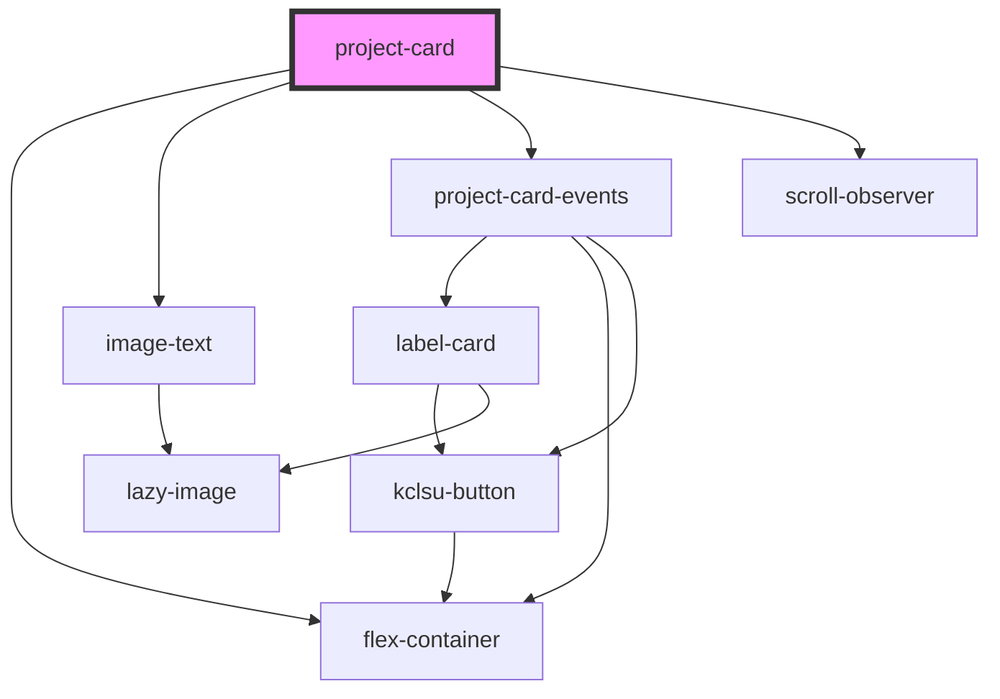

# project-card

<!-- Auto Generated Below -->

## Properties

| Property       | Attribute      | Description                                                                                                          | Type      | Default        |
| -------------- | -------------- | -------------------------------------------------------------------------------------------------------------------- | --------- | -------------- |
| `alignx`       | `alignx`       | Position the content of the card along the X axis                                                                    | `string`  | `'flex-start'` |
| `aligny`       | `aligny`       | Position the content of the card along the Y axis                                                                    | `string`  | `'center'`     |
| `alleventsurl` | `alleventsurl` | If displaying events, set a custom URL for 'all events' in place of dynamically created URL                          | `string`  | `undefined`    |
| `eventtag`     | `eventtag`     | Display an event listing                                                                                             | `string`  | `undefined`    |
| `focusarea`    | `focusarea`    | The primary image focus area. standard CSS object-position values to set a focus area on the image. EG 'center left' | `string`  | `'center'`     |
| `heading`      | `heading`      |                                                                                                                      | `string`  | `undefined`    |
| `hideimage`    | `hideimage`    | Applies to mobile displays only. Will hide the image and display content only                                        | `boolean` | `false`        |
| `image`        | `image`        |                                                                                                                      | `string`  | `undefined`    |
| `text`         | `text`         |                                                                                                                      | `string`  | `undefined`    |
| `transparent`  | `transparent`  |                                                                                                                      | `boolean` | `false`        |

## Dependencies

### Depends on

- [flex-container](../../../containers/flex-container)
- [image-text](../../../cards/image-text)
- [project-card-events](project-card-events)
- [scroll-observer](../../../scroll)

### Graph

----------------------------------------------

*Built with [StencilJS](https://stenciljs.com/)*
