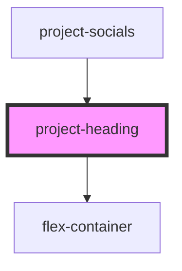

# project-section

<!-- Auto Generated Below -->

## Properties

| Property           | Attribute          | Description                                                                                                           | Type     | Default            |
| ------------------ | ------------------ | --------------------------------------------------------------------------------------------------------------------- | -------- | ------------------ |
| `colourscheme`     | `colourscheme`     | The colours for the background & text of <project-heading>, separated with a comma. eg "text colour, bg colour"       | `string` | `"white, #502669"` |
| `heading`          | `heading`          | The <h2> heading for the section                                                                                      | `string` | `undefined`        |
| `pagetitle`        | `pagetitle`        | The <h1> heading for a page. There should only be one pagetitle for page. Use the heading attribute for other titles. | `string` | `undefined`        |
| `pagetitlecolours` | `pagetitlecolours` | The colours for the <h1> heading, separated with a comma. eg "h1 colour, bg colour"                                   | `string` | `"white, #1BA39C"` |
| `text`             | `text`             | The paragraph text. If you need text links or separate paragraphs, rather insert HTML.                                | `string` | `undefined`        |

## Dependencies

### Used by

 - [project-socials](../project-socials)

### Depends on

- [flex-container](../../../containers/flex-container)

### Graph

----------------------------------------------

*Built with [StencilJS](https://stenciljs.com/)*
