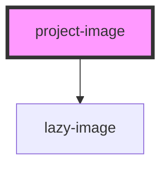

# project-image

<!-- Auto Generated Below -->

## Properties

| Property    | Attribute   | Description                                                    | Type     | Default     |
| ----------- | ----------- | -------------------------------------------------------------- | -------- | ----------- |
| `alt`       | `alt`       | The alt tage for the image                                     | `string` | `undefined` |
| `focusarea` | `focusarea` | Choose an area of the image to focus: top, left, right, bottom | `string` | `'center'`  |
| `link`      | `link`      | The image URL link                                             | `string` | `undefined` |

## Dependencies

### Depends on

- [lazy-image](../../../images/lazy-image)

### Graph

----------------------------------------------

*Built with [StencilJS](https://stenciljs.com/)*
