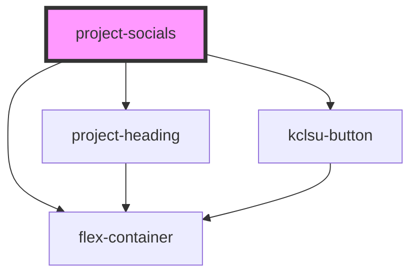

# project-socials

<!-- Auto Generated Below -->

## Properties

| Property       | Attribute      | Description                                                                                                     | Type     | Default     |
| -------------- | -------------- | --------------------------------------------------------------------------------------------------------------- | -------- | ----------- |
| `colourscheme` | `colourscheme` | The colours for the background & text of <project-heading>, separated with a comma. eg "text colour, bg colour" | `string` | `undefined` |
| `hashtag`      | `hashtag`      | The hashtag used in social media. Do not include the hash symbol                                                | `string` | `undefined` |
| `slotr`        | `slotr`        | For developers only. The name of the slot for this component to be inserted                                     | `string` | `"socials"` |

## Dependencies

### Depends on

- [project-heading](../project-heading)
- [flex-container](../../../containers/flex-container)
- [kclsu-button](../../../buttons/kclsu-button)

### Graph

----------------------------------------------

*Built with [StencilJS](https://stenciljs.com/)*
