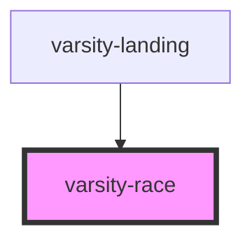

# varsity-race

<!-- Auto Generated Below -->

## Properties

| Property | Attribute | Description | Type     | Default     |
| -------- | --------- | ----------- | -------- | ----------- |
| `data`   | `data`    |             | `any`    | `undefined` |
| `target` | `target`  |             | `number` | `undefined` |

## Dependencies

### Used by

 - [varsity-landing](..)

### Graph

----------------------------------------------

*Built with [StencilJS](https://stenciljs.com/)*
