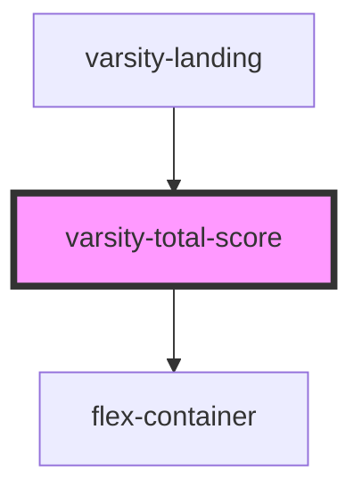

# varsity-total-score

<!-- Auto Generated Below -->

## Properties

| Property | Attribute | Description | Type  | Default     |
| -------- | --------- | ----------- | ----- | ----------- |
| `scores` | `scores`  |             | `any` | `undefined` |

## Dependencies

### Used by

 - [varsity-landing](..)

### Depends on

- [flex-container](../../../../containers/flex-container)

### Graph

----------------------------------------------

*Built with [StencilJS](https://stenciljs.com/)*
