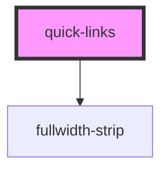

# quick-links

<!-- Auto Generated Below -->

## Properties

| Property | Attribute | Description | Type     | Default           |
| -------- | --------- | ----------- | -------- | ----------------- |
| `name`   | `name`    |             | `string` | `'quick access.'` |

## Dependencies

### Depends on

- [fullwidth-strip](../containers/fullwidth-strip)

### Graph

----------------------------------------------

*Built with [StencilJS](https://stenciljs.com/)*
