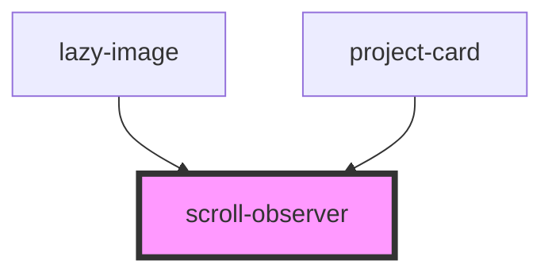

# scroll-observer

<!-- Auto Generated Below -->

## Properties

| Property    | Attribute   | Description                                                                                                | Type      | Default     |
| ----------- | ----------- | ---------------------------------------------------------------------------------------------------------- | --------- | ----------- |
| `animation` | `animation` | Select the animation name for the child component on intersection. Choose from list of supplied animations | `string`  | `'scaleIn'` |
| `lazyimage` | `lazyimage` | If true, the component will render a child lazy-image                                                      | `boolean` | `undefined` |

## Dependencies

### Used by

 - [lazy-image](../images/lazy-image)
 - [project-card](../projects/projectpage/project-card)

### Graph

----------------------------------------------

*Built with [StencilJS](https://stenciljs.com/)*
