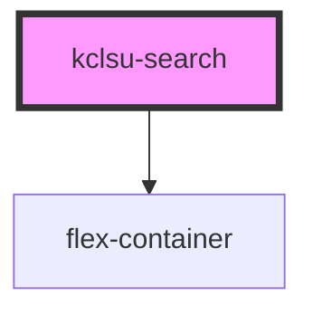

# kclsu-search

<!-- Auto Generated Below -->

## Properties

| Property                         | Attribute           | Description                                                                                                         | Type     | Default       |
| -------------------------------- | ------------------- | ------------------------------------------------------------------------------------------------------------------- | -------- | ------------- |
| `attr`                           | `attr`              | If searching an custom web component, provide the name of the atrribute to query                                    | `string` | `undefined`   |
| `containerselector` _(required)_ | `containerselector` | The container of the search result / search field, used to hide the element from results. Can be a tag, class or id | `string` | `undefined`   |
| `placeholdertext`                | `placeholdertext`   | The text inside the search input, which disappears once a user starts typing                                        | `string` | `"search..."` |
| `selector`                       | `selector`          | If searching an HTML element, provide the element's selector - tag, class or id                                     | `string` | `undefined`   |

## Dependencies

### Depends on

- [flex-container](../../containers/flex-container)

### Graph

----------------------------------------------

*Built with [StencilJS](https://stenciljs.com/)*
