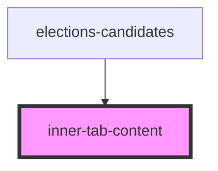

# inner-tab-content

<!-- Auto Generated Below -->

## Properties

| Property | Attribute | Description | Type      | Default     |
| -------- | --------- | ----------- | --------- | ----------- |
| `active` | `active`  |             | `boolean` | `false`     |
| `name`   | `name`    |             | `string`  | `undefined` |

## Dependencies

### Used by

 - [elections-candidates](../../../projects/elections/elections-candidates)

### Graph

----------------------------------------------

*Built with [StencilJS](https://stenciljs.com/)*
