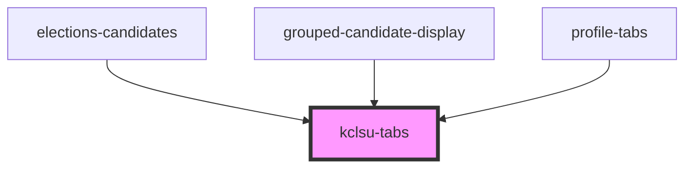

# kclsu-tabs

<!-- Auto Generated Below -->

## Properties

| Property  | Attribute | Description | Type                                     | Default     |
| --------- | --------- | ----------- | ---------------------------------------- | ----------- |
| `variant` | `variant` |             | `"primary" \| "secondary" \| "tertiary"` | `'primary'` |

## Methods

### `focusFirstTab() => Promise<void>`

#### Returns

Type: `Promise<void>`

## Dependencies

### Used by

 - [elections-candidates](../../projects/elections/elections-candidates)
 - [grouped-candidate-display](../../projects/elections/elections-candidates/grouped-candidates-display)
 - [profile-tabs](../../profiles)

### Graph

----------------------------------------------

*Built with [StencilJS](https://stenciljs.com/)*
