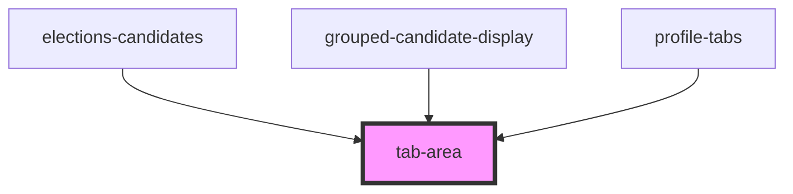

# tab-area

<!-- Auto Generated Below -->

## Properties

| Property    | Attribute   | Description | Type      | Default     |
| ----------- | ----------- | ----------- | --------- | ----------- |
| `active`    | `active`    |             | `boolean` | `false`     |
| `name`      | `name`      |             | `string`  | `undefined` |
| `pagemodal` | `pagemodal` |             | `boolean` | `false`     |

## Events

| Event       | Description | Type               |
| ----------- | ----------- | ------------------ |
| `closeArea` |             | `CustomEvent<any>` |

## Methods

### `findFocus() => Promise<void>`

#### Returns

Type: `Promise<void>`

## Dependencies

### Used by

 - [elections-candidates](../../../projects/elections/elections-candidates)
 - [grouped-candidate-display](../../../projects/elections/elections-candidates/grouped-candidates-display)
 - [profile-tabs](../../../profiles)

### Graph

----------------------------------------------

*Built with [StencilJS](https://stenciljs.com/)*
