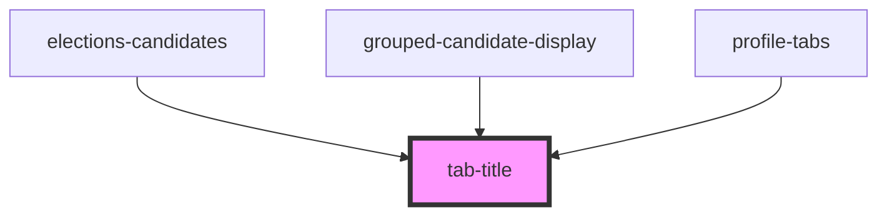

# tab-title

<!-- Auto Generated Below -->

## Properties

| Property    | Attribute   | Description                                                 | Type                                     | Default     |
| ----------- | ----------- | ----------------------------------------------------------- | ---------------------------------------- | ----------- |
| `active`    | `active`    | Is the tab title active, and corresponding tab area visible | `boolean`                                | `false`     |
| `name`      | `name`      | A unique name, matching the name of the tab area component  | `string`                                 | `undefined` |
| `pagemodal` | `pagemodal` |                                                             | `boolean`                                | `false`     |
| `variant`   | `variant`   |                                                             | `"primary" \| "secondary" \| "tertiary"` | `'primary'` |

## Events

| Event                     | Description | Type               |
| ------------------------- | ----------- | ------------------ |
| `selectFocussableElement` |             | `CustomEvent<any>` |
| `selectTabName`           |             | `CustomEvent<any>` |

## Methods

### `addFocus() => Promise<void>`

#### Returns

Type: `Promise<void>`

## Dependencies

### Used by

 - [elections-candidates](../../../projects/elections/elections-candidates)
 - [grouped-candidate-display](../../../projects/elections/elections-candidates/grouped-candidates-display)
 - [profile-tabs](../../../profiles)

### Graph

----------------------------------------------

*Built with [StencilJS](https://stenciljs.com/)*
