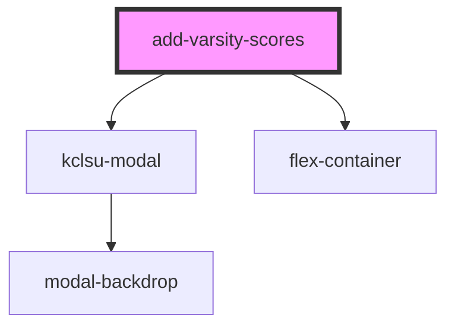

# add-varsity-scores

<!-- Auto Generated Below -->

## Properties

| Property | Attribute | Description | Type     | Default     |
| -------- | --------- | ----------- | -------- | ----------- |
| `year`   | `year`    |             | `string` | `undefined` |

## Dependencies

### Depends on

- [kclsu-modal](../../modal)
- [flex-container](../../containers/flex-container)

### Graph

----------------------------------------------

*Built with [StencilJS](https://stenciljs.com/)*
