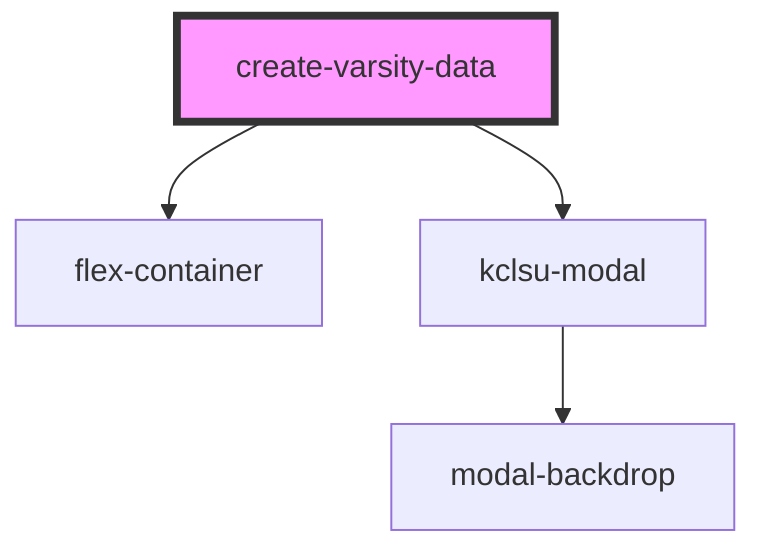

# create-varsity-data

<!-- Auto Generated Below -->

## Properties

| Property      | Attribute     | Description | Type      | Default     |
| ------------- | ------------- | ----------- | --------- | ----------- |
| `allowcreate` | `allowcreate` |             | `boolean` | `undefined` |
| `allowupdate` | `allowupdate` |             | `boolean` | `undefined` |
| `msltag`      | `msltag`      |             | `string`  | `undefined` |
| `test`        | `test`        |             | `boolean` | `undefined` |
| `year`        | `year`        |             | `string`  | `undefined` |

## Dependencies

### Depends on

- [flex-container](../../containers/flex-container)
- [kclsu-modal](../../modal)

### Graph

----------------------------------------------

*Built with [StencilJS](https://stenciljs.com/)*
