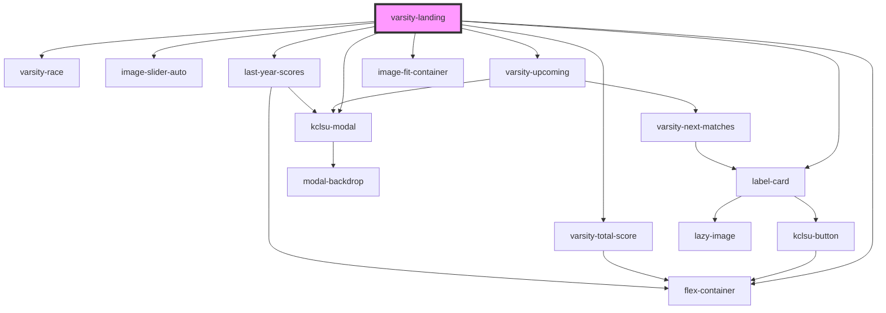

# varsity-landing

<!-- Auto Generated Below -->

## Properties

| Property      | Attribute | Description | Type                                                                                 | Default        |
| ------------- | --------- | ----------- | ------------------------------------------------------------------------------------ | -------------- |
| `currentDate` | --        |             | `{ weekday: string; day: any; month: string; year: any; hours: any; minutes: any; }` | `returnDate()` |
| `year`        | `year`    |             | `string`                                                                             | `undefined`    |

## Dependencies

### Depends on

- [label-card](../../cards/label-card)
- [varsity-total-score](varsity-total-score)
- [varsity-race](varsity-race)
- [image-slider-auto](../../images/image-slider-auto)
- [varsity-upcoming](varsity-upcoming)
- [flex-container](../../containers/flex-container)
- [kclsu-modal](../../modal)
- [last-year-scores](last-year-scores)
- [image-fit-container](../../images/image-fit-container)

### Graph

----------------------------------------------

*Built with [StencilJS](https://stenciljs.com/)*
