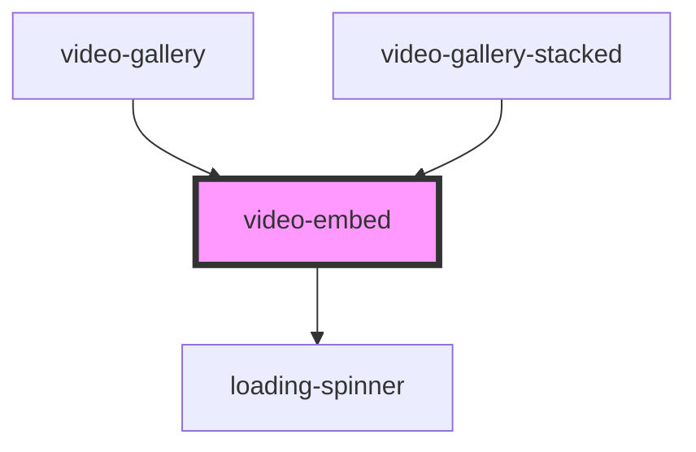

# video-embed

<!-- Auto Generated Below -->

## Properties

| Property  | Attribute | Description                                                                      | Type     | Default     |
| --------- | --------- | -------------------------------------------------------------------------------- | -------- | ----------- |
| `embedid` | `embedid` | The id of the Youtube Video - found in the URL eg youtube.com/watch?v={VIDEO_ID} | `any`    | `undefined` |
| `url`     | `url`     | The URL of the Youtube video you want to display - CURRENTLY NOT WORKING         | `string` | `undefined` |

## Dependencies

### Used by

 - [video-gallery](../video-gallery)
 - [video-gallery-stacked](../video-gallery-stacked)

### Depends on

- [loading-spinner](../../spinner)

### Graph

----------------------------------------------

*Built with [StencilJS](https://stenciljs.com/)*
