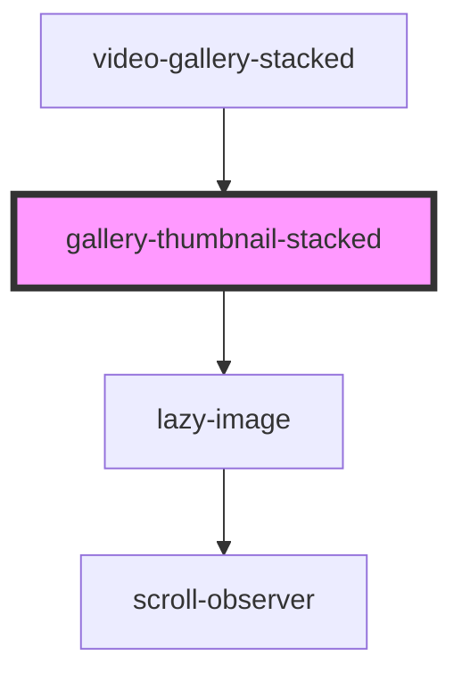

# gallery-thumbnail-stacked

<!-- Auto Generated Below -->

## Properties

| Property     | Attribute    | Description | Type      | Default     |
| ------------ | ------------ | ----------- | --------- | ----------- |
| `active`     | `active`     |             | `boolean` | `undefined` |
| `cardheight` | `cardheight` |             | `string`  | `undefined` |
| `emitid`     | `emitid`     |             | `string`  | `undefined` |
| `image`      | `image`      |             | `string`  | `undefined` |
| `videotitle` | `videotitle` |             | `string`  | `undefined` |

## Events

| Event       | Description | Type               |
| ----------- | ----------- | ------------------ |
| `emitClick` |             | `CustomEvent<any>` |

## Dependencies

### Used by

 - [video-gallery-stacked](..)

### Depends on

- [lazy-image](../../../images/lazy-image)

### Graph

----------------------------------------------

*Built with [StencilJS](https://stenciljs.com/)*
