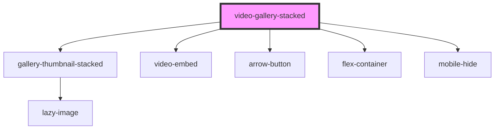

# video-gallery-stacked

<!-- Auto Generated Below -->

## Properties

| Property                | Attribute     | Description                                                           | Type      | Default     |
| ----------------------- | ------------- | --------------------------------------------------------------------- | --------- | ----------- |
| `playlist` _(required)_ | `playlist`    | The Youtube URL for any given playlist                                | `any`     | `undefined` |
| `showcurrent`           | `showcurrent` | This will display the current selected video. Desktop and tablet only | `boolean` | `false`     |
| `shuffle`               | `shuffle`     | This will randomise the order of the thumbnails                       | `boolean` | `false`     |

## Dependencies

### Depends on

- [gallery-thumbnail-stacked](gallery-thumbnail-stacked)
- [video-embed](../video-embed)
- [arrow-button](../../buttons/arrow-button)
- [flex-container](../../containers/flex-container)
- [mobile-hide](../../containers/mobile-hide)

### Graph

----------------------------------------------

*Built with [StencilJS](https://stenciljs.com/)*
